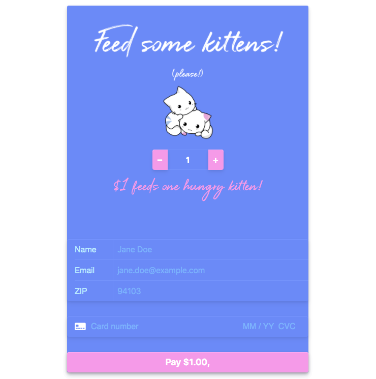

# Feed Some Kittens

Simple web application that enables one time payments through Stripe to donate food for kittens.



## Installation

**Clone from Github**

`git clone https://github.com/dpmald/stripe-example-react.git`

**Install dependencies**

Install [nodemon](https://github.com/remy/nodemon) globally

```
npm i nodemon -g
```

or, if needed,

```
sudo npm i nodemon -g
```

Install [Yarn](https://classic.yarnpkg.com/en/docs/install/)

```
brew install yarn
```

Install server and client dependencies

```
yarn
cd client
yarn
```

**Run the application**

To start the server and client at the same time (from the root of the project)

```
yarn dev
```


## Using the application

The web application should open in localhost:3000/
1. Select how many kittens you would like to feed, up to 20.
2. Enter sample name, email, and zip code
3. Enter in Stripe's test credit card information to simulate a payment:

---> Successful payment: 4242 4242 4242 4242

---> Payment w/verification: 4000 0027 6000 3184

---> Declined payment: 4000 0000 0000 9995

All three work with an expiration date in the future and any CVC.

4. Successful payments are logged and can be viewed in payments.txt

Questions? dpmald@gmail.com   
